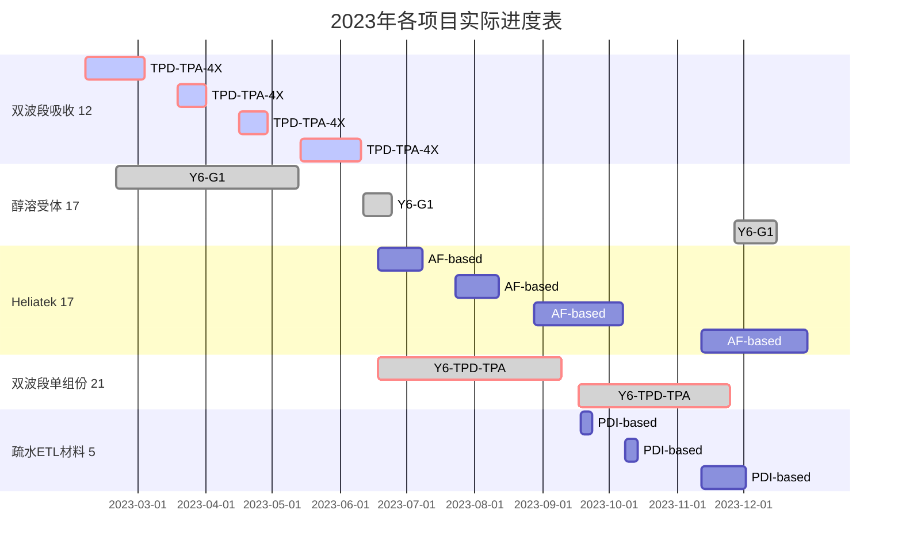
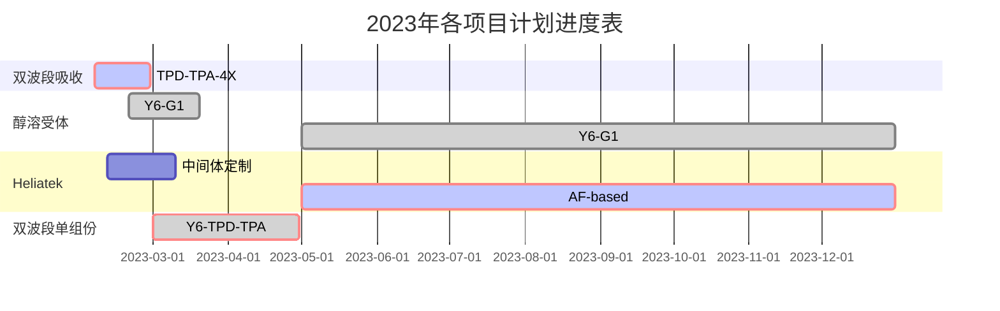

## 上半年工作计划表

正文

```mermaid
 gantt
     dateFormat  YY-MM-DD
     title 2023年各项目实际进度表
     section 双波段吸收 12
     TPD-TPA-4X            :crit, active,   des1, 23-02-05,23-03-04
     TPD-TPA-4X            :crit, active,   des2, 23-03-19,23-04-01
     TPD-TPA-4X            :crit, active,   des3, 23-04-16,23-04-29
     TPD-TPA-4X            :crit, active,   des4, 23-05-14,23-06-10

     section 醇溶受体 17
     Y6-G1            :done,    des1, 23-02-19,23-05-13
     Y6-G1            :done,    des2, 23-06-11,23-06-24
     Y6-G1            :done,    des3, 23-11-27,23-12-16

     section Heliatek 17
     AF-based            :    des1, 23-06-18,23-07-08
     AF-based            :    des2, 23-07-23,23-08-12
     AF-based            :    des3, 23-08-28,23-10-07
     AF-based            :    des3, 23-11-12,23-12-30
  
     section 双波段单组份 21
     Y6-TPD-TPA            :crit,done,    des1, 23-06-18,23-09-09
     Y6-TPD-TPA            :crit,done,    des2, 23-09-17,23-11-25
   
     section 疏水ETL材料 5
     PDI-based            :    des1, 23-09-18,23-09-23
     PDI-based            :    des2, 23-10-08,23-10-14
     PDI-based            :    des3, 23-11-12,23-12-02 
     
```

```mermaid
 gantt
     dateFormat  YY-MM-DD
     title 2023年各项目计划进度表
     section 双波段吸收
     TPD-TPA-4X            :crit, active,   des1, 23-02-05,23-02-28

     section 醇溶受体
     Y6-G1            :done,    des1, 23-02-19,23-03-20
     Y6-G1            :done,    des1, 23-05-01,23-12-31

     section Heliatek
     中间体定制            :    des1, 23-02-10,23-03-10
     AF-based             :crit, active, des2, 23-05-01,23-12-31
  
     section 双波段单组份
     Y6-TPD-TPA            :crit,done,    des1, 23-03-01,23-04-30
    
```

