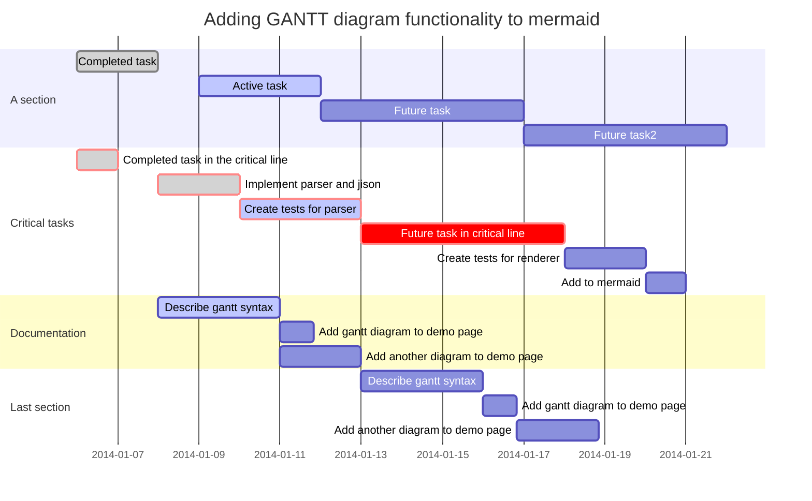
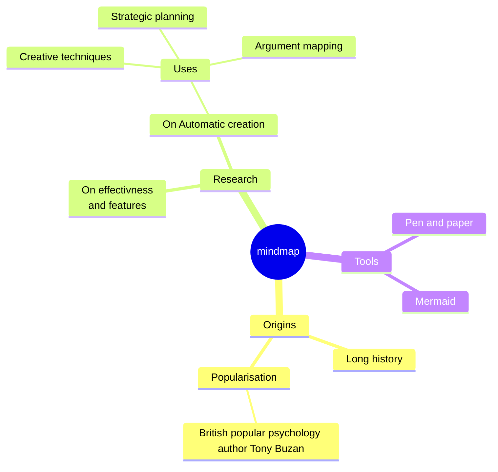
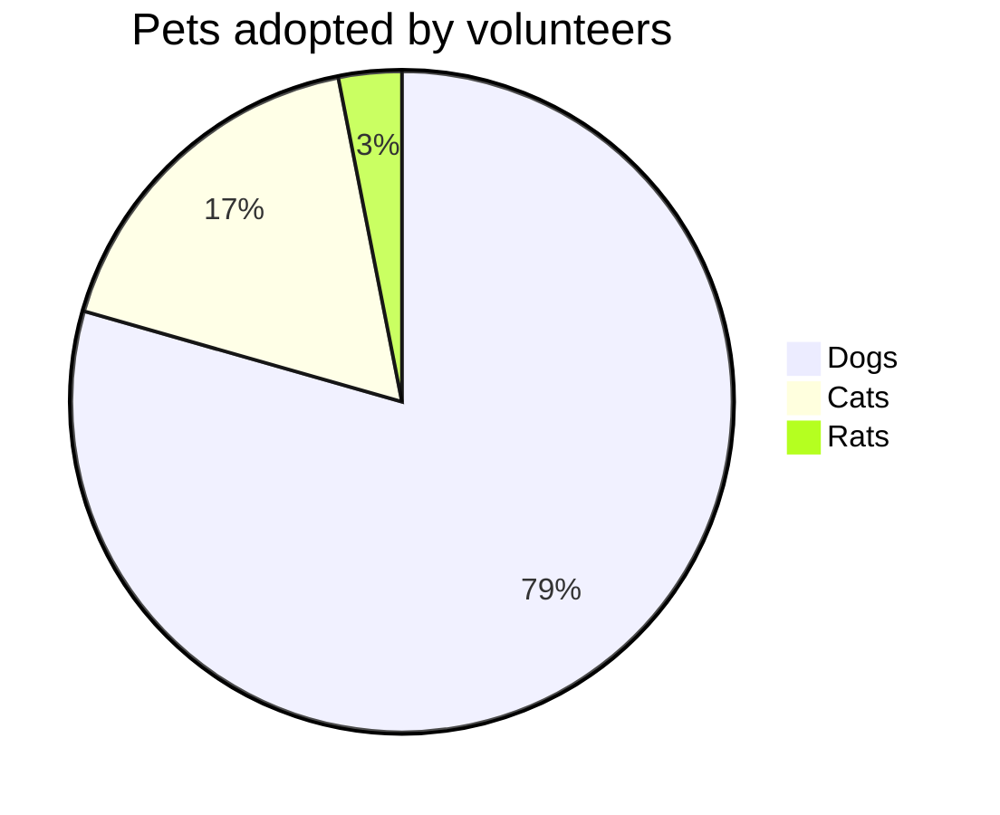

## gantt图

```mermaid
 gantt
     dateFormat  YYYY-MM-DD
     title Adding GANTT diagram functionality to mermaid
     section A section
     Completed task             :done,    des1, 2014-01-06,2014-01-08
     Active task                :active,  des2, 2014-01-09, 3d
     Future task                :         des3, after des2, 5d
     Future task2               :         des4, after des3, 5d
 
     section Critical tasks
     Completed task in the critical line :crit, done, 2014-01-06,24h
     Implement parser and jison          :crit, done, after des1, 2d
     Create tests for parser             :crit, active, 3d
     Future task in critical line        :crit, 5d
     Create tests for renderer           :2d
     Add to mermaid                      :1d
 
     section Documentation
     Describe gantt syntax               :active, a1, after des1, 3d
     Add gantt diagram to demo page      :after a1  , 20h
     Add another diagram to demo page    :doc1, after a1  , 48h
 
     section Last section
     Describe gantt syntax               :after doc1, 3d
     Add gantt diagram to demo page      : 20h
     Add another diagram to demo page    : 48h
```

## mindmap

```mermaid
 mindmap
  root((mindmap))
    Origins
      Long history
      ::icon(fa fa-book)
      Popularisation
        British popular psychology author Tony Buzan
    Research
      On effectivness<br/>and features
      On Automatic creation
        Uses
            Creative techniques
            Strategic planning
            Argument mapping
    Tools
      Pen and paper
      Mermaid
```

## pie图

```mermaid
 pie title Pets adopted by volunteers
    "Dogs" : 386
    "Cats" : 85
    "Rats" : 15
```

